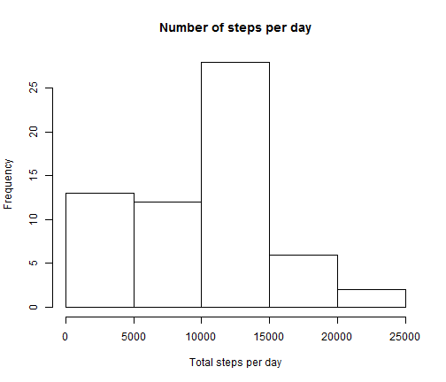
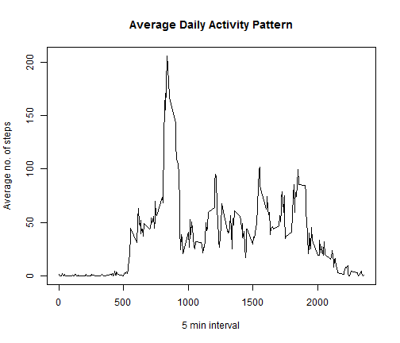
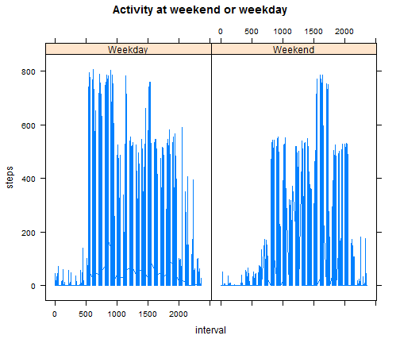

## Loading and preprocessing the data

```r
activity <- read.csv("activity.csv")
```


## What is mean total number of steps taken per day?

```r
library(plyr)
totals <- ddply(activity, c("date"),summarise,steps=sum(steps,na.rm=TRUE))
```


```r
hist(totals$steps,main="Number of steps per day",xlab="Total steps per day")
```

 


```r
mean <- round(mean(totals$steps),1)
median <- median(totals$steps)
```
### The mean of the data is 9354.2 and the median is 10395.

## What is the average daily activity pattern?


```r
average <- ddply(activity, .(interval),summarise,mean=mean(steps,na.rm=TRUE))
```


```r
plot(average,type="l",xlab="5 min interval", ylab="Average no. of steps", main="Average Daily Activity Pattern")
```

 


```r
maxSteps <- average[max(average$mean),]$interval
```
### The maximum number of steps is 1705.

## Imputing missing values
### Using mean of the interval to input missing values...

```r
missing <- sum(is.na(activity))
activityWithMean <- arrange(join(activity, average), interval)
```

```
## Joining by: interval
```

```r
activityWithMean$steps[is.na(activityWithMean$steps)] <- activityWithMean$mean[is.na(activityWithMean$steps)]
noOfSteps <- ddply(activityWithMean,.(date),summarise,steps=sum(steps))
```


```r
hist(noOfSteps$steps,main="No. of steps per day",xlab="No. of steps")
```

 


```r
newMean <- as.numeric(mean(noOfSteps$steps))
newMedian <- as.numeric(median(noOfSteps$steps))
originalTotal <- sum(totals$steps)
newTotal <- sum(noOfSteps$steps)
diff <- as.numeric(newTotal - originalTotal)
percentChange <- round(diff/originalTotal *100,1)
```
#### The new mean is 1.0766 &times; 10<sup>4</sup> and the new median is 1.0766 &times; 10<sup>4</sup>. 
#### These have changed quite a bit so our use of the mean for the intervals was not good!
#### Also the difference in the total number of steps from the original dataset to our one with missing values computed is 8.613 &times; 10<sup>4</sup>
#### This represents a change of 15.1%

## Are there differences in activity patterns between weekdays and weekends?
### The plot below shows the changes in patterns between weekdays and weekends.

```r
activityWithMean$day <- weekdays(as.Date(activityWithMean$date),abbreviate=FALSE)
weekendDays <- c("Saturday","Sunday")
activityWithMean$Weekend <- as.factor(ifelse(activityWithMean$day %in% weekendDays, "Weekend","Weekday"))
library(lattice)
```


```r
xyplot(steps ~ interval | Weekend, data = activityWithMean,type="l",main="Activity at weekend or weekday")
```

 


### There is generally more steps in total but also weekdays show more earlier in the day rather than later at the weekend.
